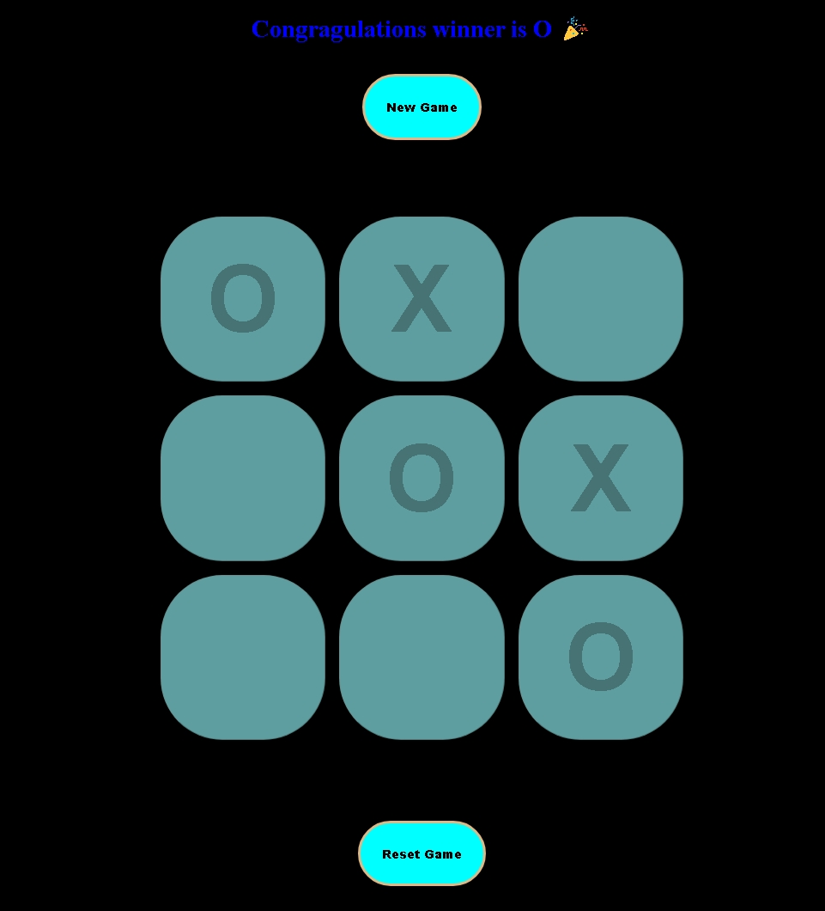
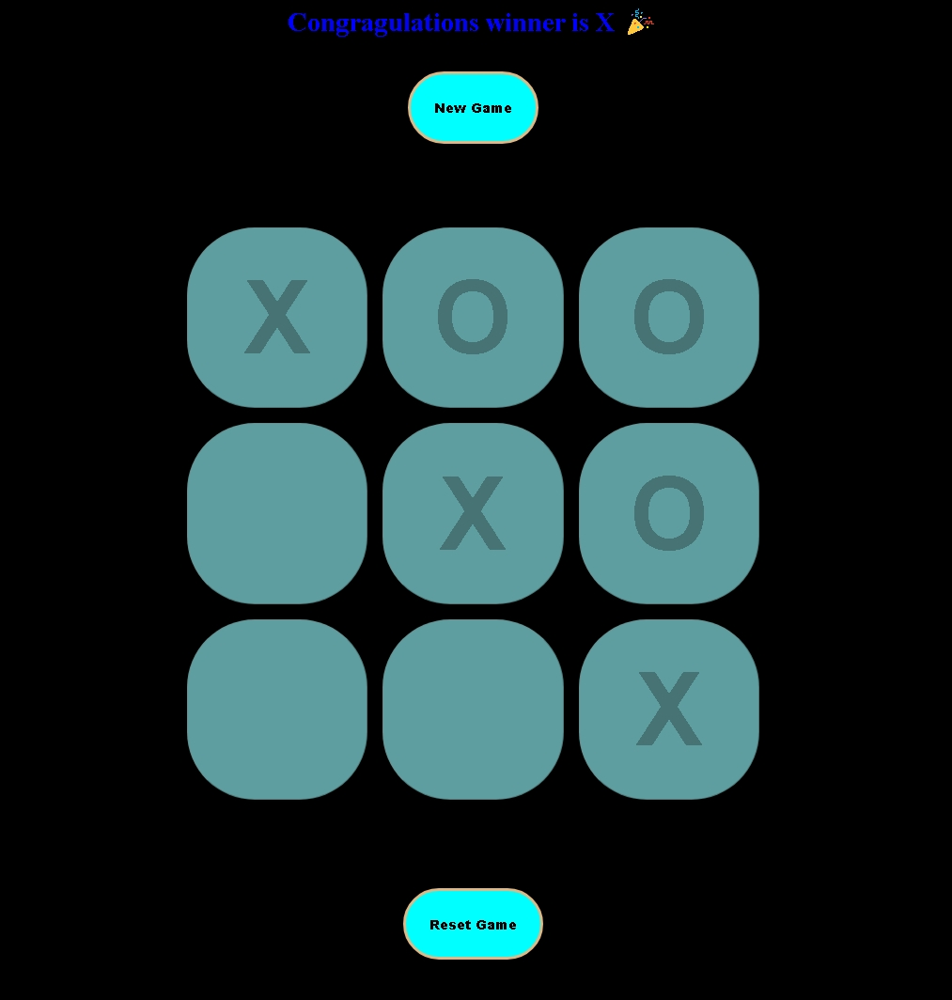
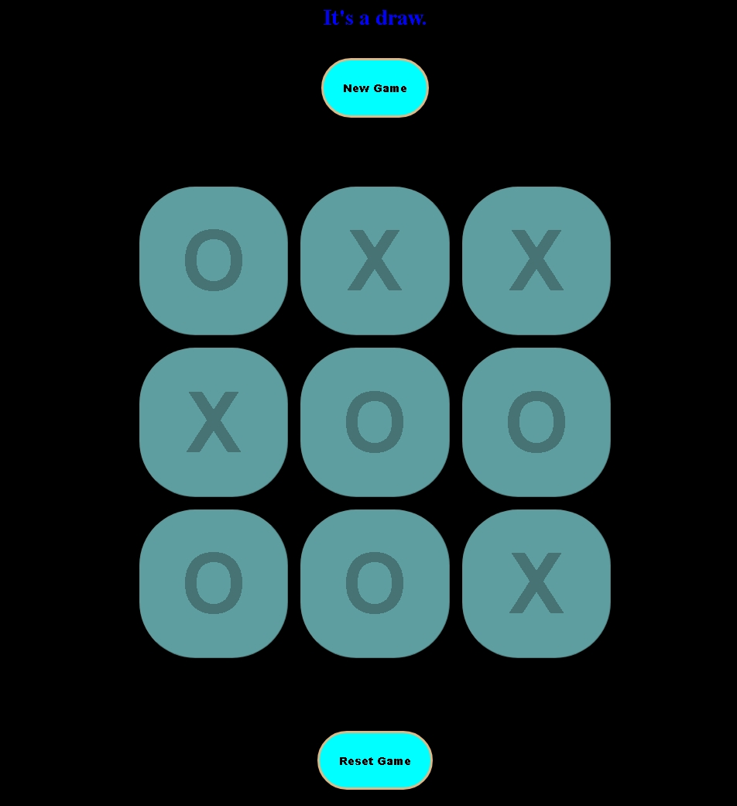

# XOX – Tic Tac Toe Game

Hello! ????
This is a basic **Tic-Tac-Toe (XOX)** game developed with **HTML, CSS, and JavaScript**.
Two players take turns placing **X** or **O** on the board in this game.
The player who wins by making a winning pattern (row, column, or diagonal) is declared the winner.

---

## ???? How to Play
1. The game begins with **Player O**.
2. Players turn by clicking on the boxes to set their symbol (X or O).
3. A player has won if they win a **row, column, or diagonal** with the same symbol.
4. If all the boxes are filled and no player has won, it's a **draw**.
5. You can reset at any time using the **Reset** button.

---

## ????️ Screenshot





---

## ????️ Tech Stack
- **HTML5**
- **CSS3**
- **JavaScript (Vanilla)**

---

## ???? How to Run Locally
1. Clone the repository:
   ```bash
   git clone https://github.com/YOUR-USERNAME/xox-tic-tac-toe.git
```

